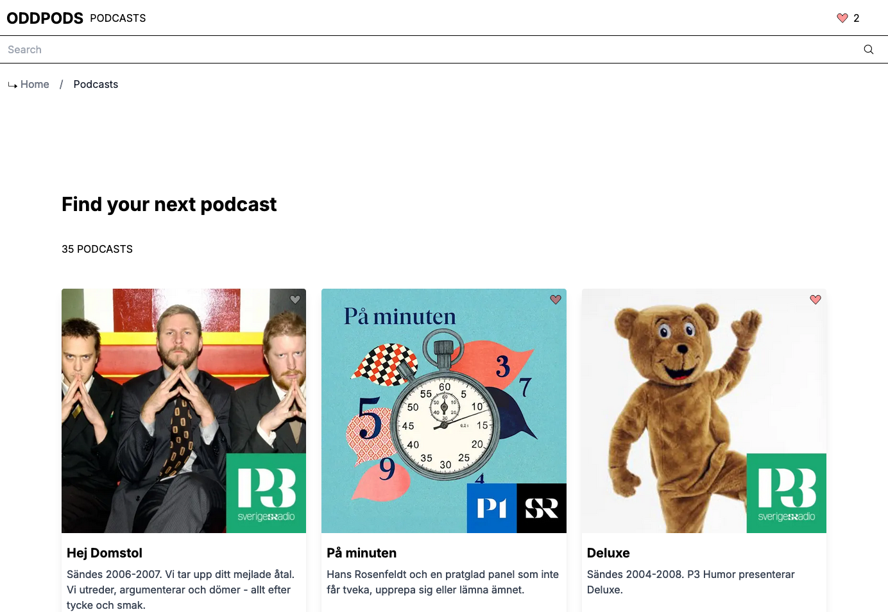

# ODDPODS

**ODDPODS** - A simple podcast search application using fetched data from Swedish Radio's open API 🎧

## Features

The application fetches data from Swedish Radio's open API and focuses on the following features:

### Search for a specific podcast

Search functionality that implements use-debounce to reduce unnecessary updates or API calls.

### Favourites functionality

The user can add and remove podcasts to their list of favourites by clicking the heart-icon in the top right corner of the podcast cards.

## Tech Stack

